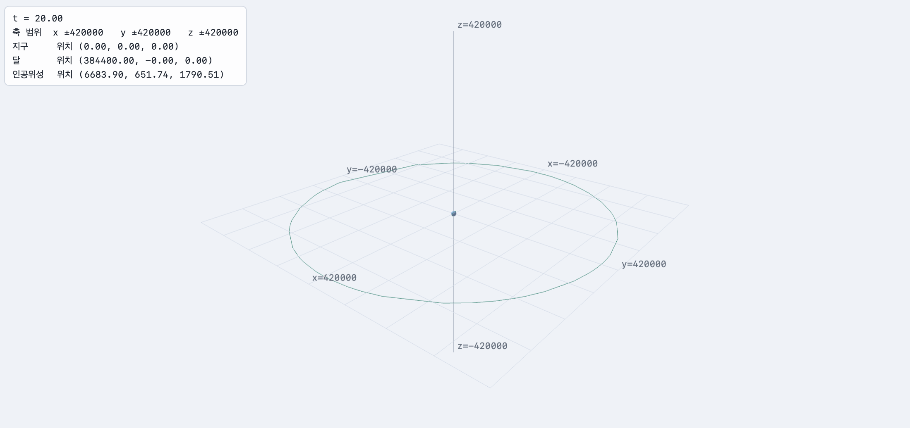
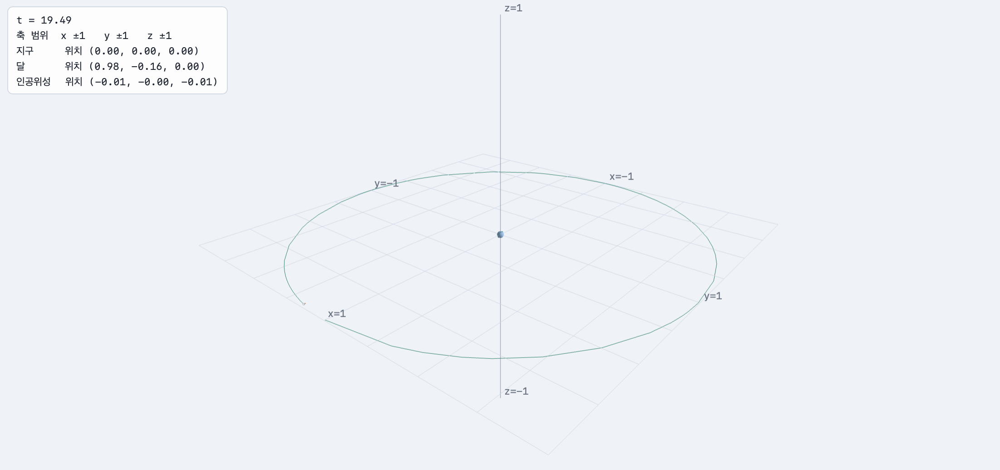

# 2주차 보고서


## Task 1

### 1. 대상 인공위성
Starlink 4623

위성 자체의 기울기: Inclination: 69.9987

하루에 14.983304번 지구를 돕니다.

크기:  길이 0.2m, 직경 2.8m, 폭 9m


### 2. 수치조사
| 항목 | 값 | 출처 |
| --- | --- | --- |
| 지구 반지름 | 6371 km | 위키백과 |
| 지구 자전축 기울기 | 23.5° | 위키백과
| 달 자전축 기울기 | 3.60°에서 6.69°사이 | 위키백과 |
| 지구-달 거리 | 384400 km | https://news.kbs.co.kr/news/pc/view/view.do?ncd=5180866 |
| 달 공전 주기 | 27.3일 | https://view.asiae.co.kr/article/2019112114315415774 |
| 달 자전 속도 | 1,670 km/h | https://www.e-science.co.kr/news/articleView.html?idxno=86860 |
| 인공위성의 크기 | 9m | https://keeptrack.space/satellite/55315 |


### 3. 변환 값 및 설계
```json
{
  "range": {
    "x": "70",
    "y": "70",
    "z": "70"
  },
  "objects": [
    {
      "id": "earth",
      "name": "지구",
      "color": [
        0.35,
        0.6,
        0.95
      ],
      "steps": [
        {
          "type": "Su",
          "args": [
            "1"
          ]
        },
        {
          "type": "T",
          "args": [
            "0",
            "0",
            "0"
          ]
        },
        {
          "type": "Rz",
          "args": [
            "(365*360*t)/20"
          ]
        }
      ]
    },
    {
      "id": "moon",
      "name": "달",
      "color": [
        0.78,
        0.78,
        0.82
      ],
      "steps": [
        {
          "type": "Rz",
          "args": [
            "(360/20)*t"
          ]
        },
        {
          "type": "T",
          "args": [
            "60.3",
            "0",
            "0"
          ]
        },
        {
          "type": "Rz",
          "args": [
            "180"
          ]
        },
        {
          "type": "Su",
          "args": [
            "0.273"
          ]
        }
      ]
    },
    {
      "id": "sat",
      "name": "인공위성",
      "color": [
        0.95,
        0.72,
        0.35
      ],
      "steps": [
        {
          "type": "Rx",
          "args": [
            "69.9987"
          ]
        },
        {
          "type": "Rz",
          "args": [
            "(27.3*14.983304*360*t)/20"
          ]
        },
        {
          "type": "T",
          "args": [
            "6950.19/6371",
            "0",
            "0"
          ]
        },
        {
          "type": "Su",
          "args": [
            "0.03"
          ]
        }
      ]
    }
  ]
}
```

전제:  t이 0에서 20으로 증가할 때 달이 지구를 한 바퀴 공전한다

**—지구—** 

| Rz | Rx | S |
|---|---|---|
| ((27.3*360)/20)*t | 23.5 | 1 |

Rz의 경우 달의 공전 주기가 27.3일이므로 지구는 t가 20이 될때까지 총 27.3바퀴를 돌아야 합니다.
Rx는 지구 자전축의 기울기입니다.

**—달—** 

| Rz | T | Rx | Rz | S |
|---|---|---|---|---|
| (360/20)*t | 60.3(지구-달거리),0,0 | 6.7 | 180 | 0.273 |

첫 번째 Rz는 공전을 담당합니다. 컴퓨터의 x는 가로, y는 세로기에 z값이 물체가 앞으로 뚫고 나가게 도와줍니다.
그렇기에 공전은 Rz값을 사용합니다. 공전 Rz를 먼저 놓는 이유는 코드는 오른쪽부터 왼쪽으로 적용되기 때문입니다. 

Rx는 달의 자전축의 기울기입니다. 편의상 6.7이라 적었습니다.

두 번째 Rz값은 달이 지구를 향하게 합니다. 

지구의 반지름을 1이라고 할 때 달의 크기는(S)는 0.273이 되어야 합니다. 

**--인공위성--**

| Rx | Rz | T | S |
|---|---|---|---|
| 69.9987 | (27.3*14.983304*360*t)/20 | 6950.19/6371,0,0 | 9/6371000 |

Rx는 위성 자체의 기울기로 Inclination 값입니다.

Rz는 Mean Motion을 활용합니다. 인공위성이 하루에 14.983304번 돕니다. t=20은 27.3일이기에 (27.3*14.983304*360*t)/20입니다.

T는 Semi-major Axis을 지구 반지름과 나눈 값, 0, 0입니다.

크기는 9m/지구 반지름 길이(m)로 계산했습니다.


### 6. 질문에 대한 답안

**1. 거리의 단위를 무엇으로 정했는가? 왜 그렇게 정했는가?**
   
지구 반지름을 1로 정했습니다. km과 m는 32비트의 유효숫자는 7자리를 초과할 것 같기에 배제하였으며 지구의 반지름을 최대한 간단한 수로 해 복잡한 연산을 최대한 피하고 싶었습니다.

**2. 숫자가 커서 생긴 문제가 있었는가? 있었다면 무엇인가?**

축 범위가 너무 커 한눈에 들어오지 않았습니다. 

**3. 달·위성이 지구를 향하게 만든 것은 어느 변환 단계 덕분인가?**

두 번째 회전 Rz 단계입니다.


### 7. 

- [ ] 변환 입력값을 적었다
- [x] 캡처를 넣었다


## Task 2

### 1. 결과

- [ ] 변환 입력값을 적었다
- [x] 캡처를 넣었다


### 2. 질문에 대한 답


**1. s를 얼마로 정했고 그 값을 어떻게 계산했는가?**
1/(60.3+0.273)로 s를 정했습니다.
task1의 결과를 봤을 때 달의 바깥쪽 가장자리가 가장 멀리 있었습니다. 또한 지구 반지름을 1, 지구-달거리를 60.3으로 정했기에 1/ ((지구-달거리)+달 반지름)하며 달을 중심으로 계산했습니다. 

**2. 배율 행렬을 사슬의 맨 앞에 넣은 이유는 무엇인가? 맨 뒤에 넣으면 어떻게 되는가?**

행렬은 오른쪽에서 왼쪽으로 적용된다. 만약 맨 뒤에 둔다면 가장 먼저 배율을 줄이고 task1의 계산이 진행된다. 이는 객체의 크기만 줄어들고 이동하는 동선의 크기는 task1과 동일해 공전을 하는 달과 인공위성이 좌표계를 벗어나는 결과가 초래한다. 그렇기에 배율행렬응ㄹ 사슬의 맨 앞에 넣어 task1의 계산을 진행한 뒤 최종적으로 크기를 줄이는 것이 효과적으로 장면 전체를 작게 만드는 방법이다. 

**3. 세 물체에 같은 배율을 쓴 이유는 무엇인가?**

물체마다 다른 배율을 쓰면 실제 배율이 깨지기 때문입니다. 
task2는 task1의 결과를 유지하되 배율만 줄이는 것이기에 모두 같은 s값을 가장 왼쪽 블럭에 적용하여 써야 합니다.

**4.비율을 유지한 결과, 화면에서 지구와 인공위성은 어떻게 보이는가?**

달의 경우 화면을 끝까지 줌 아웃을 해야지만 보입니다. 다만 이 경우 인공위성은 물론 지구또한 한눈에 잘 보이지 않아 가시성과 정보 전달력이 매우 부족합니다.


## Task 3

### 1. 결과

