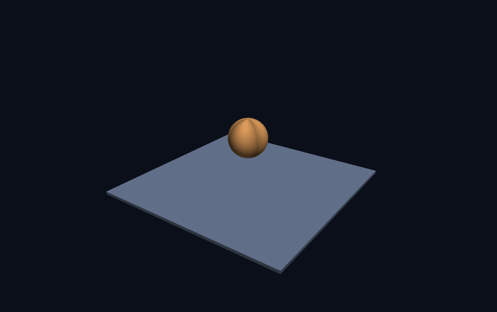
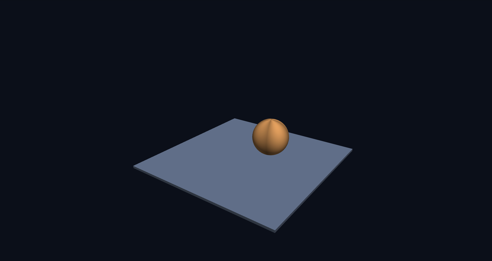
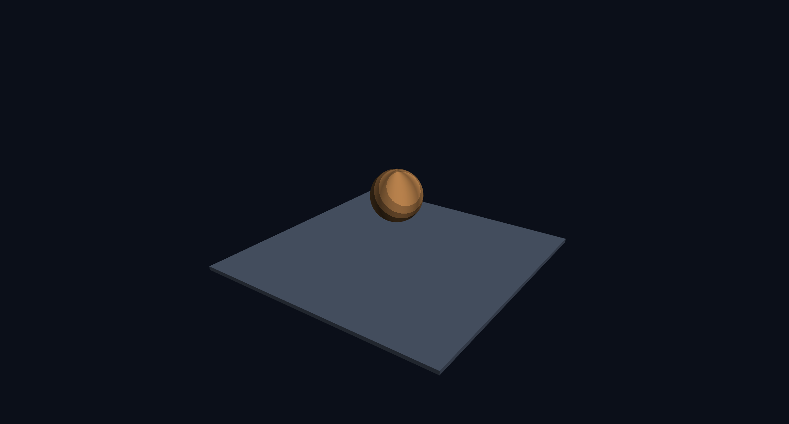

# 3주차 보고서

이름은 **이예원**, 저장소는 `cg-2026-solar/week3` 입니다.

## task 1

### 4단계
M4.rotate z는 Rz값입니다. Rz는 다음과 같습니다.
| - c | s | 0 | 0 |
|-|-|-|-|
|-s |c | 0 | 0 |
| 0 | 0 | 1 | 0 |
| 0 | 0 | 0 | 1 |

그 외 펑션은 다른 로테이션 값들과 동일하게 복사,붙여넣기를 했습니다. 

### 6단계

강의자료에 적힌 아래의 코드를 붙여넣었더니 행성이 제자리에서 돌기만 했습니다.

```html
const model = M4.multiply(M4.rotateY(time * 0.8), M4.translate(0, 1.9, 0));
```

그래서 앞뒤 움직임을 좌우하는 M4.translate의 z값에 임의의 값 2를 넣었습니다. 수정 후 코드는 다음과 같습니다.

```html
const model = M4.multiply(M4.rotateY(time * 0.8), M4.translate(0, 1.9, 2));
```


rotate와 translate의 자리를 바꾸면 자전하던 행성이 공전을 합니다. 코드는 오른쪽부터 작동합니다. 


자전은 rotate가 적용된 후 translate값이 적용됩니다. 물체가 원점에서 회전한 후 움직이기에 제자리에 고정된채로 자전하는 형태가 됩니다. 


하지만 공전은 rotate와 translate의 순서를 바꾸었고 이젠 물체가 움직인 후 회전이 적용됩니다. 
이를 반복하면 회전 반경이 만들어지고 이것이 공전궤도입니다.



이것은 자전하는 구의 모습이며



이것은 공전하는 구의 모습입니다.


### 8단계

계단식 음영 셰이더를 넣어 최종 완성된 모습입니다.


## task 2

**의도 — 무엇을 만들고 싶었는가**

* 왜 그렇게 정했습니까? 보는 사람이 무엇을 느끼길 바랐습니까?
* 예시와 무엇을 다르게 하려 했습니까?
② 방법 — 어떻게 만들었는가
* 그 모습을 내려면 어떤 계산이 필요하다고 판단했습니까?
* 실제로 쓴 계산식과 그 식이 왜 그런 무늬가 되는지를 설명하세요. 최소 두 가지 요소(예: 용암 줄기, 연기)에 대해 각각 3~4줄씩.
* 뜻대로 안 된 것이 있었다면 무엇을 어떻게 고쳤는지 쓰세요. 실패한 시도와 그 이유를 쓴 보고서를 더 높게 봅니다.
함께 넣을 것 — 행성별 화면 캡처, 프래그먼트 셰이더 전체 코드, 그리고 중간에 만들다 만 화면 캡처가 있으면 좋습니다.


