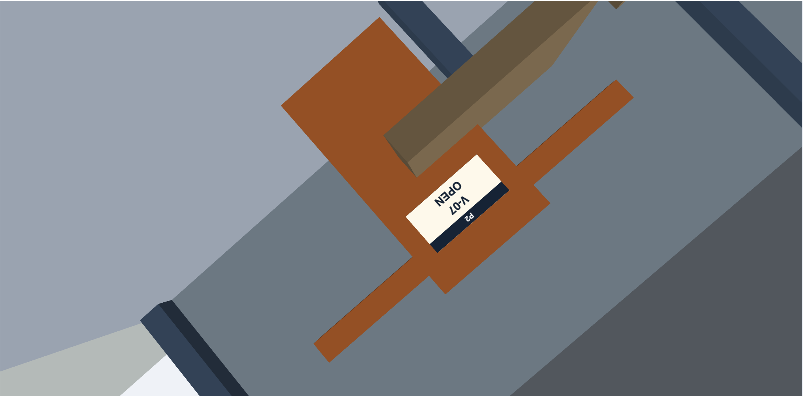
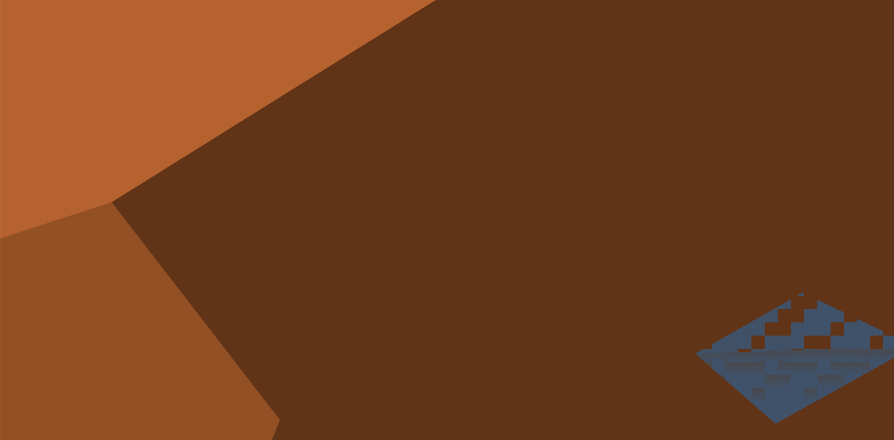
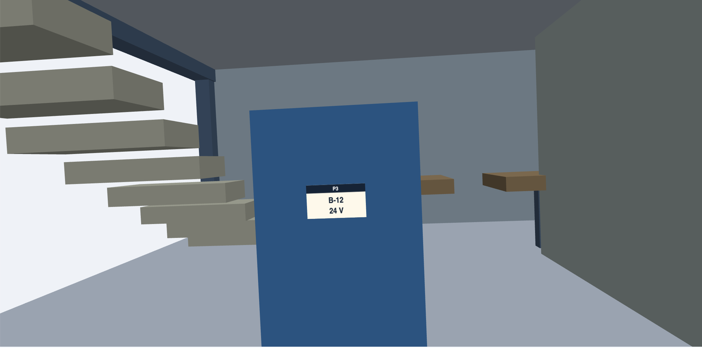

# 4주차 보고서

이름은 **이예원**, 저장소는 `cg-2026-solar/week4` 입니다.

### 6-1 관측 결과

| 지점 | 성공 실패 | 걸린 시간 | 불필요한 조작·되돌아가기 | 어려웠던 이유 |
| - | - | - | - | - |
| P1 | 성공 | 5초 | 각 + 3회, shift를 누른채 밑으로 내림 | 트랙볼을 회전할 때 수평이 되게끔하는 것이 어려웠다. |
| P2 | 성공 | 20초 | 방향키로 회전, +로 확대, shift+드래그로 위치 조정 | 확대를 여러번 했음에도 텍스트의 픽셀이 깨지지 않고 선명했다. |
| P3 | 성공 | 30초 | 트랙볼로 확대 및 오른쪽으로 화면 회전 | 마찬가지로 수평으로 이동하는 것이 힘들었다. |
| P4 | 성공 | 9초 | +와 화살표로 크기 조정, shift+드래그로 수평 조절 | 옥상에 있는 것이라 타 기물들의 방해를 받지 않고 빨리 대상을 찾을 수 있어 편리했다. |
| P5 | 성공 | 36초 | 방향키로 건물을 180도 회전한 후 드래그로 대상을 화면 중앙에 두고 +로 확대 | 일정수준 이상 확대하니 글자의 픽셀이 깨져보인다는 것을 꺠달았다. |
| P6 | 성공 | 19초 | 트랙볼로 회전 후 +로 확대 | 확대에도 한계가 있어 팻말이 화면에 꽉차게 들어오지 않는 점이 아쉬웠다. |
| O1 | 실패 | 71초 |  트랙볼, shift 드래그, 휠, 키보드 방향키 모두 사용했으나 적절한 관측이 안됐다. |  조작이 너무 불편해 전면직교뷰를 만들기가 힘들었다. |
| O2 | 성공 A | 42초 | 키보드 방향키로 우측을 보게 했고 +와 shift드래그, 트랙볼로 위치를 조정했다. | 확대할수록 중심이 아닌 쪽에 있는 물체의 크기가 훨씬 커지는 것을 보아 카메라가 원근투영을 쓰고있음을 확인했다. |

### 6-4 누구를 위해 무엇을 개선할까?

해당 프로그램은 연구시설의 구조를 확인하려는 *컴퓨터 그래픽스 비전문가*를 타겟으로 제작됐습니다. 

카메라 조정을 쉽게하고 연구시설의 앞, 뒤, 측면이 한 눈에 들어오도록 개선하고 싶었습니다.

### 6-6 구현 요구 사항

2. 4개뷰로 구성했습니다. 1사분면은 원본 화면, 2사분면은 정면, 3사분면은 우측, 4사분면은 뒷면을 보여줍니다. 

3. 직교 투영에서는 카메라 거리보다 halfHeight가 배율을 결정하므로, O1과 O2에 같은 값을 주면 같은 배율로 비교할 수 있습니다.

4. 메인 화면은 제1사분면에 존재합니다. 전체 초기화 버튼을 누르면 모든 사분면이 초기 설정과 같아집니다.

5. 사분면이 선택되면 해당 부분의 비율이 유지된채로 크기가 커집니다. 다른 사분면을 선택하면 비율과 화면 크기는 원래대로 돌아옵니다.

6. 층 숨기기 버튼을 누르면 마우스가 특수한 형태로 바뀌고 상태에서 숨기고자하는 오브제를 누르면 오브제가 사라집니다. 이후 숨기기 해제를 누르면 원상복구됩니다.

### 6-6-1 카메라 설계 설명

* eye·target·up을 어떻게 정했는가? target이 물체 위치일 때 eye는 어느 쪽에 놓이는가?
target은 카메라가 바라보는 중심점, eye는 target에서 카메라 거리만큼 떨어진 위치, up: 화면의 위쪽 방향입니다. 

* 대상 크기와 FOV에 따라 관찰 거리를 어떻게 정했는가?
FOV는 기본값인 45도로 정했고 대상의 30m로 정했다. 다만 O1, O2의 경우 원근거리가 아닌 동일한 halfHeight을 사용해 같은 배율로 보이게했습니다.

* 자유 회전의 중심을 전체 건물에 둘 것인가, 선택 대상에 둘 것인가?
건물 중심에 두었습니다. 화면 자체만을 움직이는 추가적인 버튼을 구현했기에 트랙볼 회전의 중심은 건물에 둬도 괜찮았습니다.

* 직교·원근 투영을 어디에 사용했으며 이유는 무엇인가?
직교 투영은 O1, O2를 관측하기 위해 사용했습니다. 직교투영은 멀리 있는 물체도 같은 배율로 표시하기에 정면에서의 높이와 폭, 측면에서의 돌출정도를 효과적으로 구분할 수 있습니다.
원근 투영은 기본카메라에 응용했습니다. 현실과 비슷한 입체감을 주는데 효과적이라 생각했습니다.

* 가림, near 클리핑, 카메라 이동 경로를 어떻게 다뤘는가?
가림: 카메라와 겹쳐지는 물체가 겹쳐지면 자동으로 해당 물체가 반투명처리가 되도록 했습니다.
near 클리핑: 기본값 0.02를 유지했습니다.
카메라 이동 경로: 화면에 화살표와 수평맞추기 버튼을 추가했습니다. 화살표는 화면을 기준으로만 카메라가 움직이게 조정합니다. 수평 맞추기는 카메라를 x축에 평행하도록 정렬하는 버튼입니다. 

| 비교 항목 | 기본 버전 | 개선 버전 | 해석 |
| - | - | - | - |
| 관찰 완료 수 | 7/8 | 8/8 | 간단한 조작법으로 실패가 줄었다.  |
| 전체 관찰 시간 | 232초 | 48초 | 예 |
| 조작 부담 | 가장 안쪽에 있는 P2 V-07확대 기준 161회 | 5회 | 더블클릭 포커스, 수평 맞추기로 회전과 확대가 한결 편해졌다. 트랙볼의 민감도를 낮춰 돌아가기 시행시 미세한 컨트롤 가능했다. |

구체적인 불편 3개

드래그를 할 때의 각도 민감도가 너무 높고 화면이 건물 중심으로 돌아 90도, 심하게는 180도 가까이 뒤집히는 경우가 많았습니다. 이런 현상이 발생할 때는 이를 복구하기보단 측정을 초기화하고 재접근해야했기에 동작의 효율성이 떨어졌습니다.

화면을 축소시킬때 뒤에 물체가 있다면 물체와 카메라가 겹치며 겹쳐진 물체의 속에 들어가 본래 관찰하려고했던 사물의 위치를 파악할 수 없었습니다.

줌인에 한계가 있다는 점이 아쉬웠습니다. 줌의 한계 늘린다면 더욱 자세하고 쉽게 건물을 탐방하고 특정 물체를 관측하는데 걸리는 시간이 줄어들 것이라 생각합니다.

